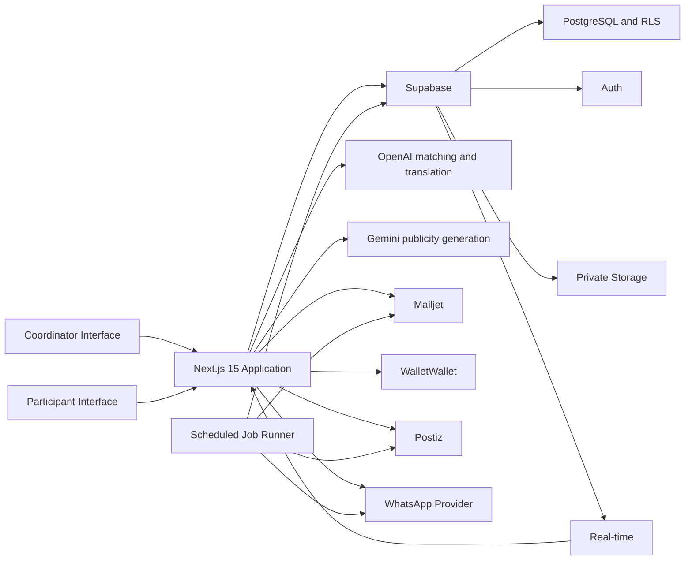

# Event Coordination and Participant Engagement Platform

## 1. Product Summary

This platform provides one workspace for planning community events, coordinating businesses and volunteers, managing participant attendance, and encouraging continued participation.

The product has exactly two user interfaces:

1. **Coordinator Interface**
2. **Participant Interface**

Businesses and volunteers do not have separate interfaces. They interact through existing channels such as WhatsApp, email, registration forms, and spreadsheets.

## 2. Product Goals

- Manage the complete event lifecycle from one workspace.
- Use AI to recommend suitable businesses and volunteers.
- Reduce manual outreach through editable, pre-filled messages.
- Track business, volunteer, and participant readiness.
- Record attendance using a digital membership QR pass.
- Automate acknowledgements and named certificates.
- Help participants understand their learning progress.
- Improve retention through reminders, badges, points, and rewards.
- Measure event outcomes and social media engagement.

## 3. Users

### 3.1 Coordinator

A staff member who creates events, coordinates businesses and volunteers, manages participants, records attendance, prepares publicity, and closes events.

### 3.2 Participant

A beneficiary who discovers and registers for events, receives reminders, presents a membership QR pass, tracks course progress, and receives certificates and rewards.

### 3.3 External Contacts

Businesses and volunteers are stored as contacts but do not log in. Coordinators communicate with them through WhatsApp, email, registration forms, and imported spreadsheets.

## 4. Event Lifecycle

```text
Create -> Ongoing -> Upcoming -> Awaiting Closure -> Archived
```

| Stage | Purpose | Exit condition |
| --- | --- | --- |
| Create | Define the event and review recommended businesses. | The event is saved and outreach begins. |
| Ongoing | Confirm businesses, volunteers, and eligible participants. | Business and volunteer targets are met. |
| Upcoming | Prepare for and conduct the event. | The event has ended and attendance is recorded. |
| Awaiting Closure | Finalise publicity and impact reporting. | Required closure information is submitted. |
| Archived | Store completed events and report analytics. | Final stage. |

All stage changes must be recorded in the event audit history. An authorised Coordinator may override a transition by entering a reason.

## 5. Coordinator Interface

### 5.1 Dashboard

**User story:** As a Coordinator, I want to see events grouped by status so that I can quickly identify what requires action.

The dashboard must provide these tabs:

- Create
- Ongoing
- Upcoming
- Awaiting Closure
- Archived

Each event card should show:

- Event name and type
- Date and venue
- Beneficiary organisation
- Current stage
- Business confirmation progress
- Volunteer recruitment progress
- Participant count
- Outstanding actions

Coordinators can search and filter events by date, type, organisation, venue, and status.

### 5.2 Create Event

**User story:** As a Coordinator, I want to create an event and receive suitable business recommendations so that partner outreach can begin quickly.

Required event fields:

- Event name
- Event type
- Description
- Date and time
- Venue
- Beneficiary organisation
- Volunteer target
- Business or sponsorship requirements
- Participant capacity
- Course prerequisites, if applicable

#### AI business recommendations

The system recommends businesses using:

- Event type and requirements
- Venue and location
- Beneficiary organisation
- Business industry and sponsorship preferences
- Previous partnerships
- Past response and participation rates

Each recommendation displays:

- Business name
- Contact person
- Match score
- Short matching explanation
- Previous event involvement
- Current contact status

The Coordinator can select, dismiss, or manually add businesses.

### 5.3 Ongoing: Business Outreach

**User story:** As a Coordinator, I want to contact and track selected businesses so that I know whether event requirements have been met.

The Coordinator can:

- Select one or more businesses.
- Review and edit a pre-filled WhatsApp message.
- Send or open the message through an approved WhatsApp integration.
- Record the date and time of contact.
- Add internal notes.
- Update each business status.

Business statuses:

- Not Contacted
- Awaiting Response
- Confirmed
- Declined

A declined business can be replaced using a new AI recommendation.

### 5.4 Ongoing: Volunteer Coordination

**User story:** As a Coordinator, I want to import and match volunteer applications so that suitable volunteers can be assigned efficiently.

Supported data sources:

- Giving.sg registration exports
- PTS registration form exports
- Excel or CSV uploads
- Other approved registration forms

The system must:

- Validate imported records.
- Detect possible duplicate volunteers.
- Display interests, skills, languages, availability, and location.
- Match volunteers to relevant ongoing events.
- Provide a match score and explanation.
- Allow the Coordinator to review and override recommendations.
- Send editable, pre-filled WhatsApp confirmations.
- Track pending, accepted, and declined assignments.

Volunteer statuses:

- Imported
- Recommended
- Contacted
- Awaiting Response
- Confirmed
- Declined
- Attended
- No-show

### 5.5 Ongoing: Participant Management

**User story:** As a Coordinator, I want to add eligible participants and verify prerequisites so that suitable participants join each event.

Supported data sources:

- Excel or CSV uploads
- Registration form submissions
- Existing participant records
- Participant self-registration

The system must:

- Check whether a participant already has an account.
- Match imported records using email and phone number.
- Flag possible duplicates for Coordinator review.
- Check completed courses against event prerequisites.
- Mark participants as eligible or ineligible.
- Explain unmet prerequisites.
- Allow authorised overrides with a recorded reason.
- Add eligible participants to the event.
- Send registration or confirmation notifications.

For a new participant, the system must:

1. Create a pending participant profile.
2. Send an account activation email.
3. Generate a digital membership QR pass.
4. Offer options to add the pass to Apple Wallet or Google Wallet.
5. Keep the same QR pass accessible from the participant profile.

Participant registration statuses:

- Invited
- Registered
- Waitlisted
- Confirmed
- Ineligible
- Cancelled
- Attended
- No-show

### 5.6 Readiness and Stage Progression

An event is ready to move from **Ongoing** to **Upcoming** when:

- The volunteer target is met.
- Required businesses are confirmed.
- The participant list is reviewed.
- Essential event details are complete.

The system displays warnings for unmet requirements. An authorised Coordinator can override the transition by providing a reason.

### 5.7 Upcoming Events

**User story:** As a Coordinator, I want to view upcoming events and record attendance so that completion and follow-up actions are automated.

#### Calendar

Events can be viewed by month, week, day, or list. Calendar entries show readiness status and outstanding actions.

#### Attendance

At the end of an event:

1. The participant presents their membership QR code.
2. The Coordinator scans it using the Coordinator Interface.
3. The system verifies the participant and event.
4. Attendance is recorded.
5. The relevant event or course is marked complete.

The system must prevent duplicate attendance records while allowing authorised corrections.

#### Automated follow-up

After attendance is confirmed, the system must:

- Display an attendance confirmation.
- Generate a named certificate.
- Email the certificate to the participant.
- Save the certificate in the participant profile.
- Open or send a pre-filled WhatsApp acknowledgement.
- Update course eligibility and learning progress.
- Award applicable points and badges.

The participant can present the QR pass from Apple Wallet, Google Wallet, or their in-app profile. Adding the pass to a mobile wallet is optional.

### 5.8 Awaiting Closure

**User story:** As a Coordinator, I want to finalise publicity and impact reporting so that the event can be properly closed.

#### Visual content and publicity

The Coordinator can:

- Upload event photos.
- Review, approve, or remove photos.
- Generate publicity copy using AI.
- Edit and approve the generated content.
- Preview content for each connected platform.
- Publish approved content through connected social media accounts.

No content may be published without Coordinator approval.

#### Closure data

The Coordinator submits:

- Participant attendance
- Volunteer attendance
- Business participation
- Beneficiary figures
- Event outcomes
- Feedback summary
- Impact figures
- Publicity links or post identifiers

Once the required information is complete, the event moves to **Archived**.

### 5.9 Archived Events and Analytics

**User story:** As a Coordinator, I want to review completed event performance so that future programmes can be improved.

The analytics dashboard includes:

- Number of events
- Registrations and attendance
- Attendance and no-show rates
- Volunteer recruitment and attendance
- Business confirmation rates
- Beneficiary reach
- Course completion
- Participant retention
- Certificates issued
- Points and rewards issued
- Social media likes, shares, impressions, and reach

Analytics can be filtered by date, event type, organisation, venue, and participant group.

## 6. Participant Interface

### 6.1 Account and Language

**User story:** As a Participant, I want to create an account in my preferred language so that I can use the platform easily.

Participants register using:

- Name
- Email address
- Phone number
- Password or one-time login method
- Preferred language
- Communication consent

Initial supported languages:

- English
- Chinese
- Malay
- Tamil

The interface, event information, reminders, and acknowledgements use the selected language where a translation is available.

### 6.2 Event Discovery and Registration

**User story:** As a Participant, I want to discover events I am eligible for so that I can continue my learning journey.

Participants can:

- Browse upcoming events.
- View event details, venue, date, capacity, and prerequisites.
- See whether they are eligible.
- Register or join a waitlist.
- Cancel a registration.
- View their registration status.
- Add confirmed events to a personal calendar.

The system recommends relevant events based on completed courses, interests, location, and participation history.

### 6.3 Alerts and Reminders

The system provides configurable reminders through:

- In-app notifications
- Email
- WhatsApp, when consent has been provided

Notifications include:

- Registration confirmation
- Upcoming event reminders
- Venue and arrival instructions
- Missing prerequisite warnings
- Event changes or cancellation
- Post-event acknowledgement

### 6.4 Membership Pass and Attendance

**User story:** As a Participant, I want flexible access to my QR pass so that I can record attendance without being required to use a mobile wallet.

The Participant can access the membership QR pass by:

- Adding it to Apple Wallet
- Adding it to Google Wallet
- Logging in and opening it from their participant profile

The Participant can present any available version of the QR code after completing an event.

After a successful scan, the Participant must:

- See confirmation that attendance was recorded.
- Receive a WhatsApp acknowledgement.
- Receive a named certificate by email.
- Find the certificate in their profile.
- Receive applicable points and badges.

### 6.5 Learning Progress

**User story:** As a Participant, I want to see my completed courses and newly unlocked opportunities so that I understand what to do next.

The Participant Interface displays a course dependency flowchart:

- Completed courses appear green.
- Currently eligible courses are highlighted.
- Locked courses show unmet prerequisites.
- Selecting a course displays its requirements and related events.

Attendance confirmation automatically updates the flowchart.

### 6.6 Achievements and Rewards

Participants can:

- Earn badges for milestones.
- Gain points for completed events.
- View their points history.
- Browse available sponsor vouchers.
- Redeem points for eligible rewards.
- View their redemption history.

All point awards and redemptions must be recorded in a transaction history.

### 6.7 Certificates and Profile

The participant profile contains:

- Personal details
- Preferred language
- Membership QR pass
- Upcoming registrations
- Attendance history
- Completed courses
- Certificates
- Badges
- Points balance
- Reward redemptions
- Submitted feedback and stories

Participants can view or download their certificates at any time.

### 6.8 Feedback and Personal Stories

Participants can:

- Rate completed events.
- Submit structured feedback.
- Share a personal impact story.
- Upload a supporting photo with consent.
- Choose whether their story can be used publicly.
- Withdraw publicity consent where applicable.

Stories remain private until approved for publication by a Coordinator.

## 7. AI Requirements

AI can support:

- Business recommendations
- Volunteer-to-event matching
- Participant event recommendations
- Publicity copy generation
- Translation assistance
- Impact summary generation

Every AI recommendation should include a short explanation. Coordinators must be able to override AI results.

AI must not:

- Automatically reject volunteers or participants.
- Override course eligibility rules.
- Publish content without Coordinator approval.
- Expose sensitive participant information to businesses or volunteers.
- Make final decisions based on protected personal characteristics.

## 8. Core Data Entities

- User
- Coordinator profile
- Participant profile
- Event
- Beneficiary organisation
- Business and business contact
- Volunteer and volunteer application
- Event assignment
- Participant registration
- Attendance record
- Course and course prerequisite
- Membership pass
- Certificate
- Notification and message
- Badge
- Points transaction
- Reward
- Feedback and personal story
- Social media post and engagement metric
- Audit record

## 9. Integrations

The platform can integrate with:

- WhatsApp Business API
- Email delivery service
- Apple Wallet
- Google Wallet
- Calendar providers
- Excel and CSV imports
- Registration forms
- Social media publishing APIs
- Social media analytics APIs
- Device camera for QR scanning

If an external service is unavailable, the system must preserve the action as pending and allow the Coordinator to retry it.

## 10. Security, Privacy, and Accessibility

- Require authentication for both interfaces.
- Ensure participants can access only their own personal data.
- Restrict Coordinators to assigned programmes where applicable.
- Encrypt sensitive information in transit and at rest.
- Record changes to attendance, eligibility, event status, and points.
- Obtain consent for WhatsApp, email, photos, and personal stories.
- Do not place raw personal information in QR codes.
- Use signed, revocable QR identifiers.
- Support data correction and deletion requests.
- Meet WCAG 2.1 AA accessibility guidance where practical.
- Provide keyboard navigation, clear labels, sufficient contrast, and screen-reader-compatible forms.

## 11. MVP Scope

The initial release includes:

- Two authenticated interfaces: Coordinator and Participant
- Event creation and lifecycle dashboard
- Excel and CSV data import
- AI-assisted business and volunteer matching
- Editable WhatsApp message preparation
- Participant registration and prerequisite checks
- In-app membership QR pass
- Optional Apple Wallet and Google Wallet support
- QR attendance scanning
- Automated certificate generation
- Course dependency progress
- Basic badges and points
- AI publicity drafting
- Event closure and basic analytics

Advanced social publishing, voucher redemption, multilingual AI translation, and live engagement analytics can be delivered in later phases.

## 12. MVP Acceptance Criteria

The MVP is considered complete when:

1. A Coordinator can create an event and move it through all five lifecycle stages.
2. Business and volunteer records can be imported, matched, contacted, and tracked.
3. Participant records can be imported or self-created and checked against prerequisites.
4. A participant can access the same membership QR pass from their profile without adding it to a mobile wallet.
5. A Coordinator can scan the QR pass and record attendance once per participant per event.
6. Recorded attendance updates learning progress and produces a named certificate.
7. The certificate is emailed and saved in the participant profile.
8. Coordinators can prepare closure content and submit impact figures.
9. Archived events appear in the analytics dashboard.
10. No business, volunteer, or third user interface is required.

## 13. Technology Stack

| Layer | Technology | Responsibility |
| --- | --- | --- |
| Web application | Next.js 15 App Router, React, TypeScript | Coordinator and Participant interfaces, server-rendered pages, Server Actions, and API Route Handlers |
| Styling | Tailwind CSS | Responsive layout, design tokens, and utility styling |
| UI components | shadcn/ui and Radix UI primitives | Accessible forms, dialogs, menus, tabs, tables, calendars, and notifications |
| Backend platform | Supabase | PostgreSQL database, authentication, object storage, real-time updates, and scheduled or background functions |
| AI and ML | OpenAI API and Google Gemini API | OpenAI supports matching and translation; Gemini generates publicity concepts, image prompts, and social captions |
| Transactional email | Mailjet Send API v3.1 | Account invitations, registration receipts, reminders, attendance confirmations, and certificate delivery |
| Wallet passes | [WalletWallet](https://www.walletwallet.dev/) | Apple Wallet and Google Wallet pass creation, update, sharing, and revocation |
| Social publishing | [Postiz](https://github.com/gitroomhq/postiz-app) Public API | Connected social channels, approved post publishing or scheduling, and engagement analytics |
| Charts | Recharts | Coordinator impact, attendance, retention, recruitment, and engagement visualisations |
| Hosting and CI/CD | Vercel | Next.js hosting, preview deployments, production deployments, environment variables, and automatic Git-based CI/CD |

All application code must use TypeScript strict mode. External service model names, URLs, identifiers, and template IDs must be configurable rather than hard-coded.

## 14. System Architecture



### 14.1 Architectural Principles

- The browser communicates with Supabase only through the authenticated public client and Row Level Security policies.
- Privileged database operations and all third-party API calls run on the server.
- Service-role and third-party credentials must never be exposed to Client Components.
- Server Components are the default for data-heavy pages. Client Components are used only for interactive behaviour such as forms, calendars, charts, QR scanning, and real-time updates.
- Server Actions handle authenticated application mutations where appropriate.
- Next.js Route Handlers provide explicit boundaries for webhooks, file imports, QR validation, and external service integrations.
- Long-running or retryable tasks are processed asynchronously from a persistent job queue.
- Supabase is the system of record. External services store delivery or publishing state, but their identifiers are copied back to PostgreSQL.

### 14.2 Interface Boundaries

Only these authenticated application areas are permitted:

- `/coordinator/*`
- `/participant/*`

Shared authentication and legal pages can exist under `/auth/*` and `/legal/*`. Businesses and volunteers must not receive a separate portal or authenticated route group.

## 15. Next.js Application Structure

The recommended directory structure is:

```text
src/
  app/
    (auth)/
      login/
      register/
      activate/
    coordinator/
      dashboard/
      events/
      calendar/
      analytics/
    participant/
      events/
      calendar/
      pass/
      progress/
      rewards/
      profile/
    api/
      attendance/scan/
      imports/
      wallet/
      social/
      webhooks/
      cron/
  components/
    ui/
    coordinator/
    participant/
    shared/
  lib/
    supabase/
    ai/
    mailjet/
    walletwallet/
    postiz/
    whatsapp/
    validation/
  server/
    actions/
    repositories/
    services/
    jobs/
  types/
```

Implementation conventions:

- Use shadcn/ui components as application-owned source code and preserve the accessibility behaviour of the underlying Radix primitives.
- Use Tailwind design tokens for colour, spacing, typography, and status variants.
- Validate all form, import, Route Handler, and AI inputs with a shared runtime schema library such as Zod.
- Keep database access in typed repository modules and business rules in service modules.
- Generate Supabase database types and commit them with the application code.
- Avoid calling third-party APIs directly from React components.

## 16. Supabase Implementation

### 16.1 Authentication and Roles

Supabase Auth manages login, registration, password reset, and account activation. The `profiles` table has exactly two application roles:

- `coordinator`
- `participant`

The role is assigned by a trusted server workflow and must not be editable from the browser. Business and volunteer records must not reference an Auth user unless the person separately registers as a Participant.

Use the Supabase SSR client for authenticated Server Components, Server Actions, and Route Handlers. Protect route groups on the server and re-check authorisation inside every mutation.

### 16.2 Core Tables

All primary keys use UUIDs. All timestamps use `timestamptz`. Mutable tables include `created_at`, `updated_at`, and, where relevant, `created_by` and `updated_by`.

| Table | Important fields and constraints |
| --- | --- |
| `profiles` | `id` references `auth.users`; `role`; name; email; phone; language; communication and publicity consent |
| `coordinator_assignments` | Coordinator, organisation, or programme scope used by RLS |
| `beneficiary_organisations` | Name, contact details, eligibility metadata, and status |
| `events` | Name, type, description, date range, venue, targets, capacity, status, organisation, and version |
| `event_status_history` | Event, previous status, new status, actor, reason, and timestamp |
| `businesses` | Partner directory record, industry, location, interests, contacts, and past performance data |
| `event_businesses` | Event, business, match score, match explanation, outreach status, and notes |
| `volunteers` | Normalised imported contact, interests, skills, languages, availability, and source |
| `volunteer_imports` | Source file, import status, totals, validation errors, and uploader |
| `event_volunteers` | Event, volunteer, match score, explanation, assignment status, and attendance status |
| `courses` | Course name, description, points, and active status |
| `course_prerequisites` | Course and prerequisite course; unique pair; cycle prevention enforced by validation |
| `event_courses` | Event-to-course relationship |
| `registrations` | Event, participant, status, eligibility result, override reason, and timestamps |
| `attendance` | Event, participant, scanned by, scan time, source, and correction metadata |
| `membership_passes` | Participant, WalletWallet serial, install URLs, token version, status, and last synchronised time |
| `certificates` | Participant, event, certificate number, private storage path, issue date, and email status |
| `messages` | Recipient type, channel, template, rendered content, consent basis, provider ID, and delivery status |
| `ai_recommendations` | Use case, entity IDs, model, prompt version, structured output, score, explanation, and reviewer decision |
| `social_posts` | Event, content, approval status, Postiz post ID, target integrations, schedule, and publication status |
| `social_metrics` | Social post, integration, metric, value, measured time, and source payload |
| `badges` and `participant_badges` | Badge rules and awarded participant milestones |
| `points_transactions` | Participant, signed point amount, reason, event or reward reference, and idempotency key |
| `rewards` and `redemptions` | Sponsor reward catalogue, stock, point cost, redemption status, and fulfilment details |
| `feedback` and `personal_stories` | Event, participant, rating or story, media, consent, and approval state |
| `jobs` | Job type, payload, status, attempts, next attempt, idempotency key, and last error |
| `audit_logs` | Actor, action, entity, before and after values, request ID, and timestamp |

### 16.3 Database Constraints and Indexes

- Add a unique constraint on `registrations(event_id, participant_id)`.
- Add a unique constraint on `attendance(event_id, participant_id)` to prevent duplicate attendance.
- Add a unique constraint on every external provider ID within its provider scope.
- Add a unique constraint on `points_transactions(idempotency_key)`.
- Normalise email addresses and phone numbers before duplicate matching.
- Index foreign keys, event status and date, message status, job status and next-attempt time, and social metric timestamps.
- Use database functions or transactions for attendance, points, event stage transitions, and reward redemption.
- Never use a read-then-write sequence for stock, attendance uniqueness, or points balances when a transaction can enforce the rule.

### 16.4 Row Level Security

Enable RLS on every exposed table.

Participant policies must allow a participant to:

- Read and update permitted fields on their own profile.
- Read public or eligible events.
- Read their own registrations, attendance, pass, certificates, progress, badges, points, rewards, feedback, and stories.
- Create or update their own registrations, feedback, stories, and consent where business rules allow.

Coordinator policies must allow a Coordinator to access only events and records within their assigned organisation or programme scope. Sensitive writes, overrides, attendance corrections, and publication approvals must use explicit policies or trusted server functions.

The Supabase service-role key is limited to server-only integration and job-processing code.

### 16.5 Storage

Use separate Supabase Storage buckets:

- `event-imports-private`
- `event-photos-private`
- `approved-publicity`
- `certificates-private`
- `story-media-private`
- `wallet-passes-private`

Imports, certificates, unapproved photos, and personal stories remain private. Access them through short-lived signed URLs after an authorisation check. Only approved publicity assets may be copied into a public bucket.

### 16.6 Real-time Updates

Supabase Real-time subscriptions can update:

- Business and volunteer target progress
- Registration and attendance totals
- Job and message delivery states
- Event readiness warnings
- Social publication status

Subscriptions must follow the same access scope as normal reads. The UI must also work through refresh or polling if a real-time connection is unavailable.

## 17. Integration Implementation

### 17.1 OpenAI and Gemini

Use server-only OpenAI and Gemini integrations. Exact model IDs come from `OPENAI_MODEL` and `GEMINI_MODEL` so they can be upgraded without code changes.

Implement these separate AI services:

- `recommendBusinesses(eventId)`
- `matchVolunteers(eventId, volunteerIds)`
- `recommendParticipantEvents(participantId)`
- `translateContent(contentId, language)`
- `generateImpactSummary(eventId)`

Publicity generation uses the server-only Gemini `generateContent` API. The model ID comes from `GEMINI_MODEL`, and `GEMINI_API_KEY` must never be exposed to Client Components. Gemini produces three structured visual concepts followed by a structured FLUX image prompt and social caption. Both responses are validated against JSON schemas before use. FLUX/fal.ai remains responsible for rendering the poster image.

Business and volunteer matching should use a hybrid approach:

1. Apply deterministic eligibility, location, availability, prerequisite, and consent filters in PostgreSQL.
2. Provide only the filtered records and relevant event details to GPT-4.
3. Request a structured response containing record ID, score, explanation, and confidence.
4. Validate the response against a JSON schema.
5. Save the recommendation, model, prompt version, and source record IDs.
6. Require Coordinator review before outreach or assignment.

Prospect research must begin with the approved partner directory. AI must not invent contact details or automatically add unverified businesses. Any externally researched fact must include a source URL and review state before it becomes partner-directory data.

Minimise personal data sent to the model. Volunteer matching should use skills, interests, availability, language, and general location rather than unnecessary contact information. Set API storage options according to the organisation's data-retention requirements.

### 17.2 Mailjet

Use the Mailjet Send API v3.1 from server-only code. Store template IDs in environment variables or a database-backed template configuration.

Required transactional templates:

- Account activation
- Event registration receipt
- Event confirmation or waitlist update
- Reminder and event-change notice
- Attendance confirmation
- Named certificate delivery
- Reward redemption receipt

Certificate delivery flow:

1. Generate the certificate PDF on the server.
2. Store it in `certificates-private`.
3. Create the certificate database record.
4. Queue a Mailjet job with a stable idempotency key.
5. Send either the PDF attachment or an expiring authenticated download link.
6. Store the Mailjet message ID and delivery state.
7. Process delivery, bounce, and failure events through `/api/webhooks/mailjet`.

Retries must not generate a second certificate or send duplicate receipts. Sender domains must be verified and production templates must be tested in every supported language.

### 17.3 WalletWallet

Use WalletWallet only from server-side code. `WALLETWALLET_API_KEY` must never enter the browser bundle.

Pass creation flow:

1. Create the participant profile and membership-pass database row.
2. Generate a signed, opaque QR payload containing a pass identifier and token version, but no name, email, or phone number.
3. Call `POST https://api.walletwallet.dev/api/passes` with `barcodeFormat: "QR"`.
4. Store the returned serial number, Google save URL, hosted share URL, and synchronisation state.
5. Decode the returned Apple `.pkpass` and store it in `wallet-passes-private`, or proxy it directly through an authenticated server response.
6. Show Apple Wallet and Google Wallet actions in the Participant Interface.

In-app fallback:

- The Participant profile must render the same valid QR payload without requiring a wallet installation.
- The pass page must remain available on supported desktop and mobile browsers.
- Wallet installation state must never affect event eligibility or attendance.

Pass updates use `PUT /api/passes/{serial}` and must send the complete desired pass body because updates replace rather than merge fields. Pass revocation uses `DELETE /api/passes/{serial}`. Revoking or reissuing a pass must increment its token version so old QR values fail verification.

The WalletWallet share URL can be sent by email or WhatsApp, but access to the in-app pass remains authenticated through the Participant Interface.

### 17.4 QR Validation and Attendance

The Coordinator scanner uses the device camera in a Client Component and submits scanned data to `POST /api/attendance/scan`.

The server must:

1. Authenticate the Coordinator.
2. Verify that the Coordinator can manage the selected event.
3. Validate the QR signature, pass status, and token version.
4. Resolve the participant without exposing personal data in the QR code.
5. Confirm that the participant is registered or request an authorised override.
6. Insert attendance through one transactional database function.
7. Return an idempotent success response if attendance already exists.
8. Queue certificate, acknowledgement, learning-progress, badge, and points jobs.
9. Write an audit record.

The scanner should show a clear success, duplicate, invalid, revoked, wrong-event, or offline result. Offline scanning is out of the MVP unless a separate encrypted synchronisation design is approved.

### 17.5 Postiz Social Publishing

Use the Postiz Public API from server-only code. The recommended MVP approach is Postiz Cloud or a separately operated Postiz instance.

Publishing flow:

1. A Coordinator uploads and approves publicity assets.
2. Gemini generates channel-specific drafts.
3. The Coordinator edits and approves each draft.
4. The server retrieves available Postiz integrations or uses previously synchronised integration IDs.
5. Approved media is uploaded or supplied through a short-lived permitted URL.
6. The server creates or schedules the post through Postiz.
7. The returned Postiz post ID and target integration IDs are stored.
8. Publication failures are queued for retry and shown to the Coordinator.

Engagement synchronisation:

- A scheduled job requests post-level analytics using the stored Postiz post ID and platform-level analytics using the integration ID.
- Raw provider metrics are mapped into `social_metrics` while retaining the source label and payload.
- Recharts aggregates likes, shares, impressions, reach, followers, and engagement only when the source platform supplies them.
- The UI must show `Not available` instead of treating unavailable metrics as zero.

The Postiz repository is licensed under AGPL-3.0. If the organisation self-hosts, modifies, embeds, or distributes it, legal and security review is required. A self-hosted Postiz deployment is a separate service with its own database, workers, and Temporal runtime; it is not deployed inside the Vercel application.

### 17.6 WhatsApp

Implement WhatsApp behind a provider adapter so the delivery provider can change without rewriting event logic.

The adapter supports:

- Approved template selection
- Template variables
- Deep-link mode for a Coordinator to review and manually send
- API-send mode after business verification and participant consent
- Provider message ID and delivery-state storage
- Webhook updates and retries

The MVP may use review-and-open deep links. Fully automated sending depends on an approved WhatsApp Business account, message templates, and recipient consent.

### 17.7 Recharts

Charts run in Client Components and receive already-authorised, aggregated data from Server Components or Route Handlers.

Required chart types:

- Event attendance and no-show trends
- Volunteer target versus confirmed count
- Business outreach conversion funnel
- Participant retention and course completion
- Social engagement over time
- Impact totals by programme or organisation

Every chart must include an accessible title, legend, tooltip, text summary, and tabular or downloadable alternative where practical.

## 18. Application Workflows

### 18.1 Event Creation and Matching

1. The Coordinator submits the event form through a Server Action.
2. The server validates and inserts the event in a transaction.
3. A business-recommendation job is queued.
4. PostgreSQL pre-filters partner candidates.
5. GPT-4 ranks and explains the candidates.
6. Recommendations are saved and streamed or refreshed into the Ongoing view.
7. The Coordinator selects businesses and initiates outreach.

### 18.2 Spreadsheet Import

1. The Coordinator uploads an `.xlsx` or `.csv` file to a private temporary path.
2. A Route Handler parses the file and maps expected columns.
3. The server normalises email addresses, phone numbers, languages, interests, and availability.
4. Invalid rows are retained in an error report rather than silently discarded.
5. The Coordinator reviews a preview and confirms the import.
6. The server upserts approved rows and records source lineage.
7. The original file follows the configured retention policy and is deleted when no longer required.

### 18.3 Attendance and Certificate Delivery

1. A scan transaction records attendance once.
2. The transaction queues downstream jobs using one attendance idempotency key.
3. Learning progress, badges, and points are updated transactionally.
4. A certificate is generated and placed in private storage.
5. Mailjet sends the personalised certificate message.
6. WhatsApp sends or opens the acknowledgement.
7. Real-time updates refresh both interfaces.

Certificate or messaging failure must not roll back valid attendance. The Coordinator can retry the failed follow-up from the event record.

### 18.4 Event Closure and Social Publishing

1. The Coordinator selects approved photos.
2. Gemini produces draft text for selected channels.
3. The Coordinator edits and explicitly approves the content.
4. Postiz publishes or schedules the posts.
5. Closure figures are validated and submitted.
6. The event moves to Archived.
7. Scheduled analytics jobs continue to collect available post metrics for the configured measurement window.

## 19. API and Server Boundaries

Suggested Next.js Route Handlers:

| Method and route | Purpose |
| --- | --- |
| `POST /api/imports/volunteers` | Parse and validate volunteer imports |
| `POST /api/imports/participants` | Parse and validate participant imports |
| `POST /api/attendance/scan` | Validate a membership QR and record attendance |
| `POST /api/wallet/passes` | Create a WalletWallet pass |
| `GET /api/wallet/passes/{id}/apple` | Authorise and return the Apple pass |
| `PATCH /api/wallet/passes/{id}` | Synchronise pass fields or points |
| `DELETE /api/wallet/passes/{id}` | Revoke a pass |
| `POST /api/social/publish` | Publish approved content through Postiz |
| `POST /api/social/sync` | Synchronise integrations or engagement metrics |
| `POST /api/webhooks/mailjet` | Process Mailjet delivery events |
| `POST /api/webhooks/whatsapp` | Process WhatsApp delivery and reply events |
| `POST /api/cron/jobs` | Claim and process due background jobs |

Server Actions can handle ordinary authenticated CRUD operations such as event creation, registration, approval, feedback, and profile updates. Route Handlers are preferred when a stable HTTP endpoint, webhook, streaming response, file body, or external integration boundary is required.

Every mutating endpoint must include authentication, authorisation, input validation, request IDs, safe error responses, and idempotency where retries are possible.

## 20. Background Jobs and Reliability

Use a PostgreSQL-backed `jobs` table as a durable outbox. Creating or changing an important record and queuing its downstream work should happen in the same database transaction.

Job statuses:

- Pending
- Processing
- Succeeded
- Failed
- Cancelled

Job processing requirements:

- Claim work atomically so two workers cannot process the same job.
- Use exponential backoff with a maximum attempt count.
- Use an idempotency key for Mailjet, WalletWallet, WhatsApp, Postiz, certificate, points, and badge operations.
- Record request IDs and redacted provider responses.
- Move exhausted jobs to Failed and expose a Coordinator retry action.
- Never store API keys, full certificates, or unnecessary personal data in job payloads.

The scheduler can use a secured Vercel Cron route or a scheduled Supabase Edge Function. Only one mechanism should own a job type in production.

## 21. Environment Configuration

Required environment variables include:

```text
NEXT_PUBLIC_APP_URL
NEXT_PUBLIC_SUPABASE_URL
NEXT_PUBLIC_SUPABASE_ANON_KEY
SUPABASE_SERVICE_ROLE_KEY

OPENAI_API_KEY
OPENAI_MODEL
GEMINI_API_KEY
GEMINI_MODEL

MAILJET_API_KEY
MAILJET_SECRET_KEY
MAILJET_FROM_EMAIL
MAILJET_FROM_NAME
MAILJET_TEMPLATE_ACCOUNT_ACTIVATION
MAILJET_TEMPLATE_REGISTRATION_RECEIPT
MAILJET_TEMPLATE_CERTIFICATE

WALLETWALLET_API_KEY

POSTIZ_BASE_URL
POSTIZ_API_KEY

WHATSAPP_PROVIDER
WHATSAPP_ACCESS_TOKEN
WHATSAPP_PHONE_NUMBER_ID
WHATSAPP_GRAPH_VERSION
WHATSAPP_VERIFY_TOKEN
WHATSAPP_APP_SECRET
WHATSAPP_ACK_TEMPLATE
WHATSAPP_REMINDER_TEMPLATE
WHATSAPP_REGISTRATION_TEMPLATE
WHATSAPP_TEST_TEMPLATE

QR_SIGNING_SECRET
CRON_SECRET
```

Only values explicitly prefixed with `NEXT_PUBLIC_` may be available to the browser. Preview and production deployments must use separate Supabase projects or safely isolated schemas, storage, credentials, Postiz channels, and email sender settings.

## 22. CI/CD and Deployment

Vercel is the deployment target for the Next.js application.

Recommended pipeline:

1. A feature branch or pull request triggers a Vercel Preview deployment.
2. CI runs formatting, linting, TypeScript checks, unit tests, database tests, and a production build.
3. Supabase migration files are reviewed with the code change.
4. End-to-end smoke tests run against an isolated preview environment when configured.
5. A merge into `main` triggers the production deployment.
6. Production migrations run through a controlled migration job before features depending on them are enabled.
7. Failed application deployments are rolled back through Vercel; database migrations require explicit forward-fix or tested rollback procedures.

Do not run the self-hosted Postiz stack inside the Vercel deployment. If self-hosted Postiz is chosen, deploy it separately using its supported container architecture and configure `POSTIZ_BASE_URL` to that service.

## 23. Testing Strategy

### Unit Tests

- Eligibility and prerequisite rules
- Event transition rules
- Match-score normalisation
- QR signing and verification
- Points, badge, and reward calculations
- Template variable construction
- Provider response mapping

### Database Tests

- RLS policies for both roles
- Organisation and programme isolation
- Unique attendance and registration constraints
- Transactional attendance and points functions
- Course prerequisite cycle rejection
- Job claiming and idempotency

### Integration Tests

- Supabase Auth and Storage permissions
- OpenAI matching and Gemini publicity structured-output validation with mocked responses
- Mailjet template and attachment payloads
- WalletWallet create, update, and revoke payloads
- Postiz publishing and metric mapping
- Webhook replay and retry behaviour

### End-to-End Tests

- Coordinator creates and progresses an event.
- Coordinator imports and confirms volunteers and participants.
- Participant registers and opens the QR pass from their profile without installing a wallet pass.
- Coordinator scans the QR and records attendance once.
- Participant receives and downloads a certificate.
- Coordinator approves and publishes publicity content.
- Archived analytics display the completed event.

### Quality Gates

- No TypeScript errors
- No lint errors
- Successful production build
- No critical accessibility violations in automated checks
- No high-severity dependency vulnerabilities without an approved exception
- Manual mobile testing for camera scanning and wallet-install links

## 24. Implementation Phases

### Phase 1: Foundation

- Set up Next.js 15, TypeScript, Tailwind CSS, shadcn/ui, and Radix UI.
- Configure Supabase Auth, SSR clients, schema migrations, RLS, Storage, and generated types.
- Implement the two route groups and role-based navigation.
- Create event lifecycle, audit, and job infrastructure.

### Phase 2: Coordinator Event Operations

- Build dashboard tabs and event creation.
- Add business directory, AI recommendations, and outreach tracking.
- Add volunteer and participant spreadsheet imports.
- Implement prerequisite checks, target tracking, and stage transitions.

### Phase 3: Participant Experience and Attendance

- Build event discovery, registration, calendar, profile, and language preferences.
- Implement course dependency progress.
- Add in-app signed QR membership pass.
- Integrate WalletWallet as an optional delivery channel.
- Build Coordinator scanning and transactional attendance.

### Phase 4: Automated Follow-up and Retention

- Generate and store named certificates.
- Integrate Mailjet receipts, reminders, and certificate delivery.
- Add WhatsApp acknowledgements.
- Implement badges, points, rewards, feedback, and stories.

### Phase 5: Closure, Publicity, and Analytics

- Add photo approval and Gemini publicity drafting.
- Integrate Postiz publishing and scheduling.
- Synchronise supported engagement metrics.
- Build Recharts impact dashboards and archived-event reporting.

## 25. Technical Risks and Decisions

| Decision or risk | Required action |
| --- | --- |
| Exact GPT-4 model identifier and data-retention configuration | Select an approved model and keep it configurable through `OPENAI_MODEL`. |
| Exact Gemini model identifier and data-retention configuration | Keep publicity generation configurable through `GEMINI_MODEL` and review Google AI data-use settings. |
| WhatsApp automated sending | Confirm provider, business verification, template approval, consent, and webhook setup. |
| Postiz Cloud versus self-hosting | Choose before social implementation; complete AGPL, infrastructure, privacy, and security review for self-hosting. |
| Social platform permissions | Register and verify required platform applications early; capabilities and analytics differ by provider. |
| WalletWallet production use | Review service terms, data processing, availability, branding plan, and pass volume before launch. |
| QR replay | Use signed, revocable payloads, event-scoped Coordinator validation, audit logs, and unique attendance constraints. |
| Participant imports | Define source templates, consent basis, duplicate rules, and source-file retention. |
| Translation quality | Approve critical content with human-reviewed translations and provide an English fallback. |
| Certificate generation | Confirm template design, signatory, numbering convention, and whether a PDF attachment or authenticated link is preferred. |
| Regional compliance | Confirm hosting region, retention, consent, and cross-border transfer requirements with the organisation. |

## 26. Implementation References

- [Next.js 15 Route Handlers and Middleware](https://nextjs.org/docs/15/app/getting-started/route-handlers-and-middleware)
- [Supabase Next.js guide](https://supabase.com/nextjs)
- [Supabase Row Level Security](https://supabase.com/docs/guides/database/postgres/row-level-security)
- [WalletWallet API](https://www.walletwallet.dev/)
- [Mailjet Send API v3.1](https://dev.mailjet.com/email/guides/send-api-v31/)
- [Postiz repository](https://github.com/gitroomhq/postiz-app)
- [Postiz Public API](https://docs.postiz.com/public-api/introduction)
- [Postiz post analytics](https://docs.postiz.com/public-api/analytics/post)
- [Postiz platform analytics](https://docs.postiz.com/public-api/analytics/platform)
- [Vercel Git deployments](https://vercel.com/docs/git)
